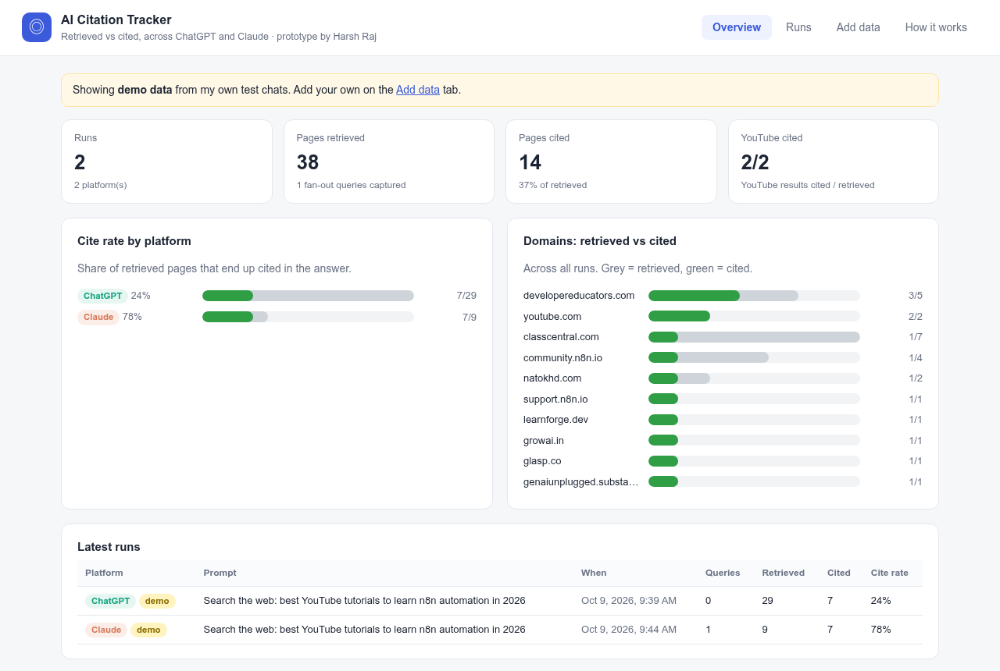

# AI Citation Tracker

**Live demo:** https://YOUR-SITE.netlify.app

I built this for the Beyond Labs interview task. When ChatGPT or Claude searches the web to answer a prompt, I wanted to see three things:

1. which search queries it ran (fan-out queries),
2. which pages it **retrieved**,
3. which of those pages it actually **cited** in the answer.

The repo has a small dashboard that runs fully in the browser, a bookmarklet that grabs the chat you have open, and a Python script that runs a list of prompts automatically.



## What I found in my own test

Prompt: *"Search the web: best YouTube tutorials to learn n8n automation in 2026"*

| | Queries | Retrieved | Cited | Cite rate |
|---|---|---|---|---|
| ChatGPT | not saved in the conversation | 29 | 7 | 24% |
| Claude | 1 (`best YouTube tutorials learn n8n automation 2026`) | 9 | 7 | 78% |

ChatGPT looks at a lot more pages and cites only a few of them. Claude searches less and cites most of what it reads. These are the two runs the dashboard shows as demo data.

## Repo layout

```
site/                 the dashboard (static, no backend)
  index.html
  app.js              UI, localStorage, import/export, bookmarklet
  parser.js           raw conversation JSON -> queries / retrieved / cited
  demo-data.js        my two test runs
  styles.css
runner/
  batch_runner.py     runs prompts.txt on ChatGPT and Claude with Playwright
  parser.py           same parsing logic in Python, also works on its own
  prompts.txt
  requirements.txt
  chatgpt_console_extractor.js   paste into DevTools on a ChatGPT chat
  claude_console_extractor.js    paste into DevTools on a Claude chat
  capture_snippet.js             records the live network stream
sample-data/          raw conversations from my test chats
docs/screenshot.png
```

## How I decide retrieved vs cited

| | ChatGPT | Claude |
|---|---|---|
| Endpoint | `/backend-api/conversation/<id>` | `/api/organizations/<org>/chat_conversations/<id>` |
| Retrieved | `metadata.search_result_groups[].entries[]` | `tool_result` blocks from `web_search` |
| Cited | inline `<Cite refs=[...]>` markers, matched to each result's `ref_id` | `citations[]` on the answer text |
| Fan-out queries | only in the live stream | `tool_use.input.query` |

ChatGPT lists the same page twice: once from the search step and once in the footer with `?utm_source=chatgpt.com`. I strip that parameter and dedupe, which is why I count 29 retrieved and not 42.

---

## Setup

### 1. Run it locally

1. Download or clone this repo.
2. Open `site/index.html` in Chrome. That's it, no install.
3. Go to **Add data** and drop in `sample-data/claude_raw.json` to check that import works.

The bookmarklet needs the site to be on a real `https://` address, so host it first (step 2).

### 2. Host it for free

**Netlify (easiest)**
1. Sign up at https://app.netlify.com.
2. Go to https://app.netlify.com/drop and drag the `site` folder onto the page.
3. In **Site configuration → Change site name**, pick a name. The site is now at `https://<name>.netlify.app`.

**GitHub Pages**
1. Push this repo to GitHub.
2. Go to **Settings → Pages**, set Source to **Deploy from a branch**, pick `main` and `/ (root)`, then click Save.
3. After about a minute the dashboard is at `https://<username>.github.io/<repo>/site/`.

### 3. Capture a chat with the bookmarklet

1. Open the hosted site and go to **Add data**.
2. Show the bookmarks bar (`Ctrl+Shift+B`) and drag **📌 Send to Citation Tracker** onto it.
3. Open a ChatGPT (`chatgpt.com/c/...`) or Claude (`claude.ai/chat/...`) chat that used web search.
4. Click the bookmark. The dashboard opens in a new tab and the run shows up.

If the browser blocks the pop-up, the bookmark downloads `chatgpt_raw.json` or `claude_raw.json` instead. Drop that file into **Add data**.

### 4. Run many prompts with the batch runner

You need Python 3.9 or newer.

```bash
cd runner
pip install -r requirements.txt
python -m playwright install chromium

python batch_runner.py --login     # log in to ChatGPT and Claude once, press Enter after each
python batch_runner.py             # runs every line in prompts.txt on both
```

Other options:

```bash
python batch_runner.py --platform claude     # only one platform
python batch_runner.py --channel chrome      # use installed Google Chrome instead of Chromium
python batch_runner.py --timeout 300         # wait longer per answer
```

Each chat is saved to `runner/out/<platform>_<n>.json`, with a `summary.json` next to them. To see them in the dashboard, drag the chat files into **Add data**.

To parse one file without the dashboard:

```bash
python parser.py ../sample-data/chatgpt_raw.json
```

### 5. Use the console extractors (no install)

Open a chat, press `F12` → **Console**, paste the matching `*_console_extractor.js` file and press Enter. It prints the results and downloads the raw JSON.

---

## Troubleshooting

| Problem | What I do |
|---|---|
| Bookmark does nothing | Allow pop-ups for chatgpt.com / claude.ai, or use the downloaded file |
| "Could not load the conversation" / 401 | Refresh the chat page and try again |
| Import says the file isn't recognised | Use the raw file, not `*_final.json` |
| Google login fails in the batch runner | Log in with email instead, or use `--channel chrome` |
| Captcha during a batch run | Solve it in the open browser window; the script keeps waiting |

## Limitations

- Both endpoints are internal and undocumented, so they can change without notice.
- ChatGPT doesn't store its fan-out queries in the saved conversation. To get them I'd need the live stream, which `capture_snippet.js` records by hand.
- The batch runner uses my own account in a real browser. I keep it to a few prompts because of captchas and the platforms' terms.
- Data sits in the browser's localStorage, so every visitor only sees their own runs.

## What I'd add next

- Parsers for Perplexity, Gemini and Google AI Mode
- Capturing ChatGPT's fan-out queries from the network stream in the batch runner
- Scheduled runs and a small shared database, so results can be tracked over time per brand or domain
